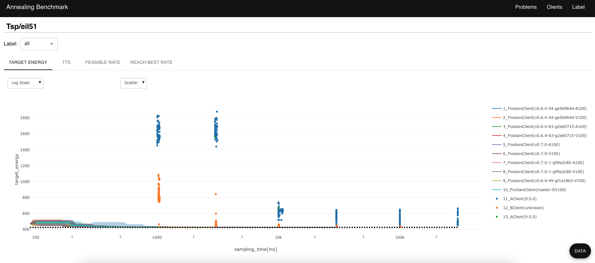
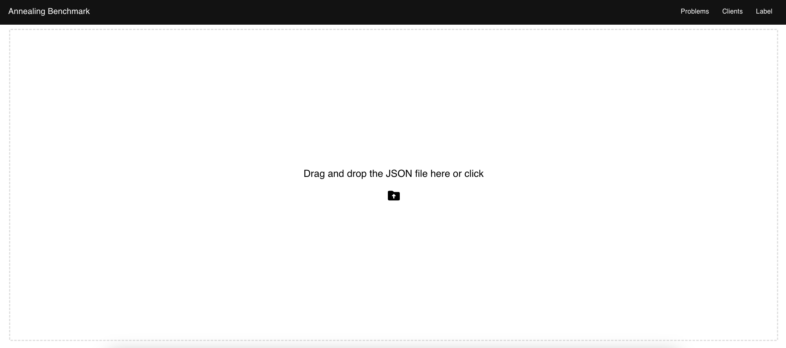
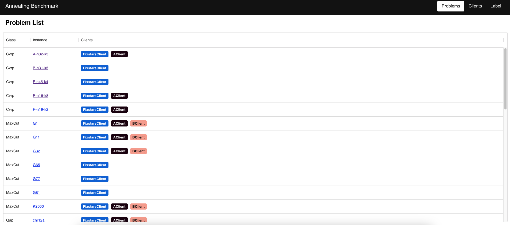
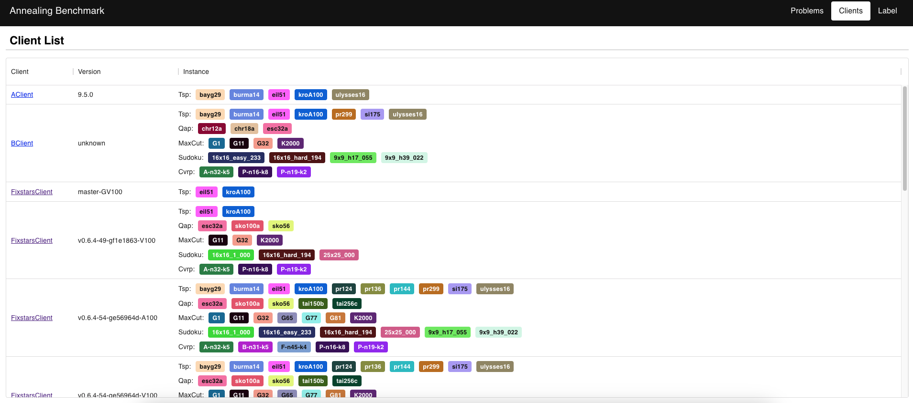
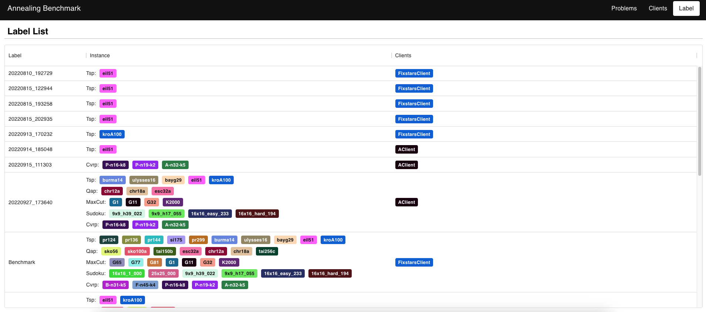
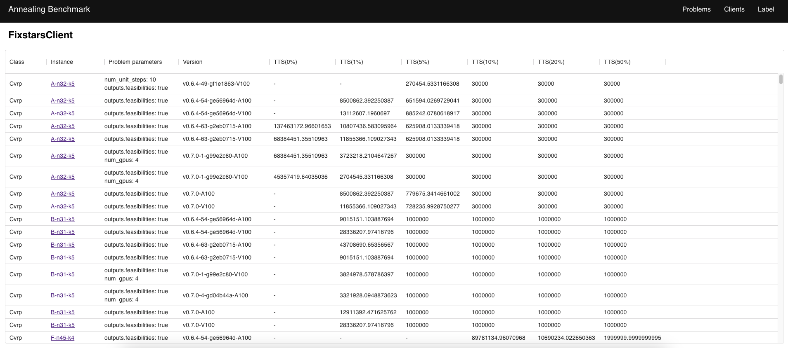

# Amplify benchmark viewer

`Amplify benchmark viewer` is a viewer for the [Amplify benchmark](https://github.com/fixstars/amplify-benchmark) data.

With the viewer, you can see your Amplify benchmark data in tables and graphs for ease and convenience like the following.



## Generate data

`Amplify benchmark viewer` is a viewer only for specific data. You can use `Amplify benchmark` to generate the data for the viewer. If you want to know how to generate the data, please see the following link.

- Amplify benchmark: [Amplify benchmark](https://github.com/fixstars/amplify-benchmark)

## Amplify benchmark viewer page

We provide the `Amplify benchmark viewer` page, so you can just drag and drop the data to the page for seeing it in tables and graphs.

- Amplify benchmark viewer page: [Amplify benchmark viewer page](https://fixstars.github.io/amplify-benchmark-viewer)

**The viewer doesn't save the data on the server.** The data is stored in the memory of the browser, so when you refresh or exit the browser, the data is removed.

## Amplify benchmark viewer on local

The viewer is based on [Create React App](https://create-react-app.dev/). So, you need the [Node.js](https://nodejs.org/) environment to use the viewer on your machine.

If you have the `Node.js` environment, execute the following commands to run the viewer on the machine.

```bash
npm install
npm start
```

If you have already the data file locally, you can see it without dragging and dropping actions. If you want to see it directly, copy the data file to the `public/data` folder and restart the viewer.

## How to use

1. Drag and drop the data to the upload page (Or copy the file(`stats.json`) to the `public/data` folder locally)



2. You can see the data by `Problems`, `Clients`, and `Labels`.

| Problems | Clients | Labels |
| -- | -- | -- |
|  |  |  |

3. You can see the details by clicking `instances` or `clients`.

| Instance detail | Client detail |
| -- | -- |
|  | 

## Develop by

`Amplify benchmark viewer` is made by

<div align="center">
  <a href="https://www.fixstars.com/" target="_blank" rel="nofollow noreferrer">
    
  </a>
  <a href="https://amplify.fixstars.com/" target="_blank" rel="nofollow noreferrer">
    
  </a>
</div>
